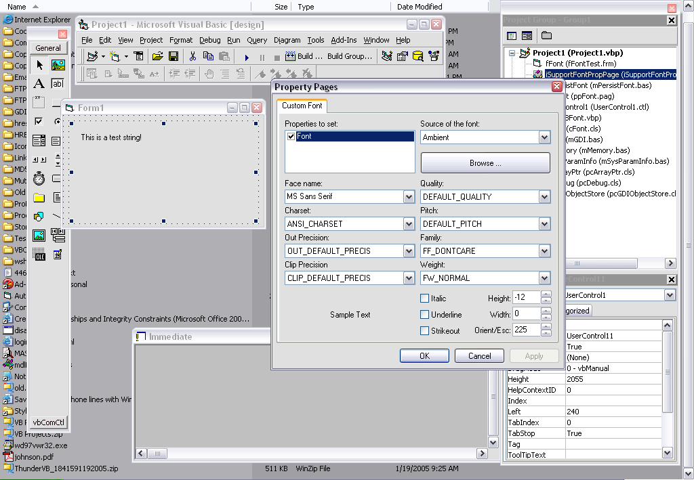



## GDI Management put to good use

### Description

Ever written a usercontrol that exposed a Font property? Then this code is for you. cFont.cls uses offers many features you won't get with the StdFont object. You can call the Browse method to show the Font dialog and the font properties will be set automatically if the user chooses a font. You can set the font to the ambient font or a system font and it will update itself provided that you call OnAmbientFontChanged from your usercontrol's AmbientChanged event or OnSettingChange in your WM_SETTINGCHANGED handler. All of the properties from the LOGFONT structure are exposed, including charset, escapement, etc. And I even included a property page that allows for multiple properties on multiple controls to be edited simeltaneously, all your controls have to do is implement the iSupportFontPropPage interface. Sound good? I had hoped so! Bug reports are much appreciated. Also, anyone who has downloaded my last submission, GDI management, should check out the new version I just uploaded with additional optimizations and much more in depth explanations and comments.
 
### More Info
 

             |
---                |---
**Submitted On**   |2005-01-19 16:56:50
**By**             |[selftaught](https://github.com/Planet-Source-Code/PSCIndex/blob/master/ByAuthor/selftaught.md)
**Level**          |Intermediate
**User Rating**    |5.0 (25 globes from 5 users)
**Compatibility**  |VB 6\.0
**Category**       |[Graphics](https://github.com/Planet-Source-Code/PSCIndex/blob/master/ByCategory/graphics__1-46.md)
**World**          |[Visual Basic](https://github.com/Planet-Source-Code/PSCIndex/blob/master/ByWorld/visual-basic.md)
**Archive File**   |[GDI\_Manage1841911192005\.zip](https://github.com/Planet-Source-Code/selftaught-gdi-management-put-to-good-use__1-58376/archive/master.zip)

